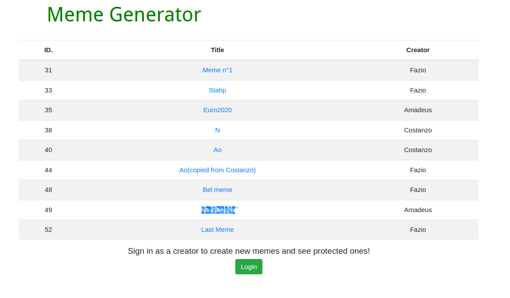
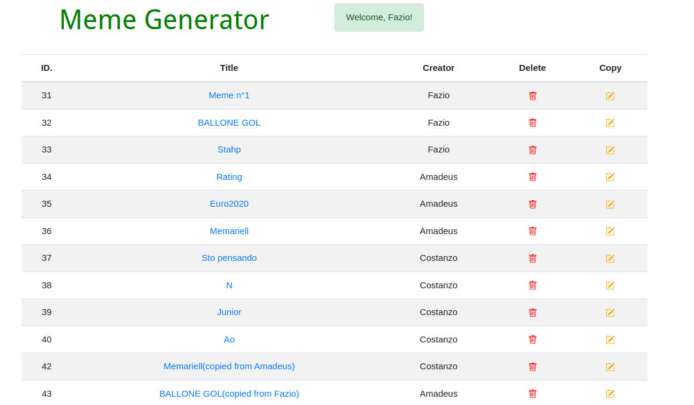
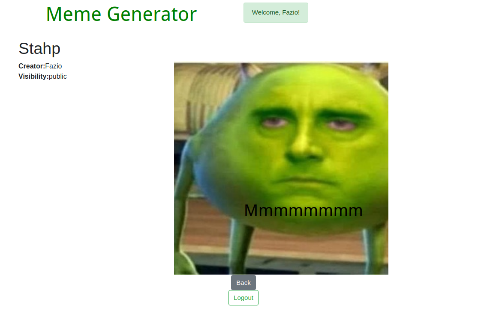
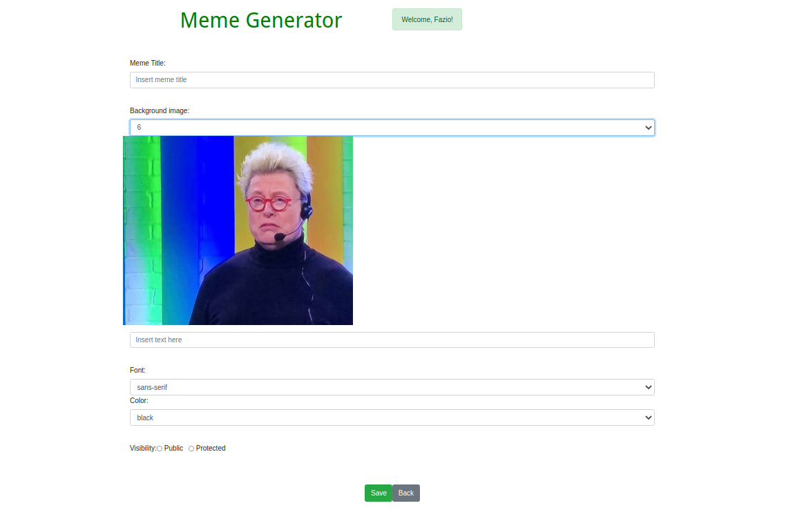

# Exam #2: "Meme Generator"
## Student: s287345 MUSTICH FEDERICO 

## React Client Application Routes

- Route `/`: Main page, displaying the meme list. It offers different functionalities depending if the user is logged in or not.
- Route `/memes:id`: Single meme visualization page. It displays the actual meme togethere with its metadata (Title, creator and visibility).
- Route `/create`: Meme creation page. Consists in a form used by the user to generate a new meme.
- Route `/copy`: Same as above. Used for generate a new meme by starting from an already existing one.
- Route `/login`: Login page.

## API Server

- GET `/api/memes` 
  - request parameters: none 
  - response body content: available memes
- GET `/api/memes/<id>`
  - request parameters: id of the requested meme
  - response body content: the requested meme
- POST `/api/memes`
  - request body: a new meme to be saved
  - response body content: status of the saving oparation
- DELETE `/api/memes/<id>`
  - request parameters: id of the meme to be deleted
  - response body content: status of the deleting operation 

## Database Tables

- Table `user` - contains id, email, password(hashed) and username
- Table `meme` - contains id, title, image(a number), sentences, visibility, creator, font and color

## Main React Components

- `MemeList, MemeTable, MemeRow` (in `MemeList.js`): used to build the table that display to the user the list of available memes.
- `MemePage, MemeView` (in `MemeComponent.js`): used to visualize a single meme and its metadata.
- `MemeCreation` (in `MemeComponent.js`): used to generate and save a new meme.
- `LoginForm, LogoutButton` (in `LoginComponents.js`): used to log in and out of the application.

## Screenshot

## Users Credentials

- "maurizio_costanzo@mediaset.it", "password" (memes id: 37, 38, 39, 40, 42)
- "giovanna_e_amadeus@rai.it", "password" (memes id: 34, 35, 36, 43, 49)
- "phazyo@raitre.it", "password" (memes id: 31, 32, 33, 44, 48, 52, 53, 56)

## WARNING: PLEASE READ!

When trying to run the application on a clean VM `npm install` was not able to correctly install a package called `chokidar`, despite it being correctly (I'm not so sure though) listed in the `package-lock.json` file. Running `npm install chokidar` manually should fix the problem.

Edit: it should be fixed now. I hope. 
